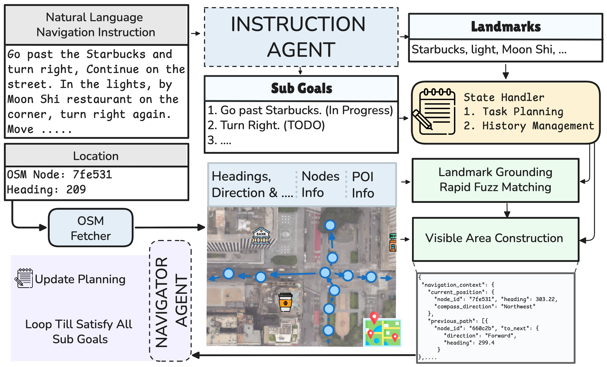

<div align="center">
  

  # GROKE: Vision-Free Navigation Instruction Evaluation via Graph Reasoning on OpenStreetMap

  🎉 **Accepted to ACL 2026 Main Conference — San Diego, USA 🇺🇸**

  [](https://arxiv.org/abs/2601.07375)
  [](https://2026.aclweb.org/)
  [](https://creativecommons.org/licenses/by-sa/4.0/)

  [📄 Paper](https://arxiv.org/abs/2601.07375) • [💻 Code](https://anonymous.4open.science/r/groke) • [🗂️ Map2Seq Dataset](https://map2seq.schumann.pub/dataset/) • [🌐 Project Page](https://fuzsh.github.io/groke/)
</div>

---

## Abstract

The evaluation of navigation instructions remains a persistent challenge in Vision-and-Language Navigation (VLN). Reference-based metrics such as BLEU and ROUGE fail to capture the functional utility of spatial directives — whether an instruction successfully guides a navigator to the intended destination. Existing VLN agents could serve as evaluators, but their reliance on high-fidelity visual simulators introduces licensing constraints, computational cost, and perception errors that confound linguistic quality assessment.

We introduce **GROKE** (**G**raph-based **R**easoning over **O**SM **K**nowledge for instruction **E**valuation), a vision-free, training-free, hierarchical LLM-based framework for evaluating navigation instructions using OpenStreetMap data. Through systematic ablation studies, we show that structured JSON and textual representations of spatial information substantially outperform grid-based and visual graph encodings. Our hierarchical architecture combines sub-instruction planning with topological graph navigation, reducing navigation error by **68.5%** compared to heuristic and sampling baselines on the Map2Seq dataset.

---

## Method

GROKE is a training-free, multi-agent hierarchical system composed of three modules:

1. **Sub-Goal & POI Extraction.** An LLM parser decomposes the instruction into atomic sub-goals (`MOVE_FORWARD`, `TURN_LEFT`, `TURN_RIGHT`) and extracts landmark mentions, grounded onto OSM POIs via fuzzy string matching.
2. **Visible Area Construction.** Starting from the current node and heading, GROKE traverses forward to the next intersections, modelling the human "line of sight" along the street. The result is a structured local graph annotated with POI proximity and relative direction.
3. **Navigator Agent.** Given the current sub-goal, position, heading, and the structured visible area (encoded as JSON), the agent selects the next waypoint and updates the sub-goal status.

<div align="center">
  
  <br><em>Overall GROKE architecture — Sub-Goal & POI Extraction, Visible Area Construction, and Navigator Agent.</em>
</div>

---

## Results

GROKE is evaluated on the [Map2Seq](https://map2seq.schumann.pub/) dataset (two 700-instance test splits).

| Method | NE ↓ | SR ↑ | OSR ↑ | SDTW ↑ | NE ↓ | SR ↑ | OSR ↑ | SDTW ↑ |
|---|---|---|---|---|---|---|---|---|
| | *Test_A* | | | | *Test_B* | | | |
| Random Walker | 259.0 | 4.4% | 5.7% | 0.026 | 244.3 | 6.1% | 7.1% | 0.029 |
| Action Sampling | 250.1 | 5.1% | 6.0% | 0.037 | 241.6 | 7.4% | 8.1% | 0.039 |
| Heuristic Agent | 180.6 | 18.0% | 18.9% | 0.155 | 173.0 | 17.9% | 19.1% | 0.159 |
| **GROKE (Ours)** | **56.8** | **66.4%** | **78.4%** | **0.634** | **59.8** | **63.3%** | **78.0%** | **0.609** |

GROKE reduces Navigation Error by **68.5%** relative to the strongest baseline and lifts Success Rate from 18.0% to 66.4% on Test_A. Gains transfer to the unseen split (Test_B: SR 17.9% → 63.3%), confirming that semantic graph reasoning generalises beyond the training distribution.

---

## Authors

- **Farzad Shami**¹ — [farzad.shami@aalto.fi](mailto:farzad.shami@aalto.fi)
- **Subhrasankha Dey**¹ — [subhrasankha.dey@aalto.fi](mailto:subhrasankha.dey@aalto.fi)
- **Nico Van de Weghe**² — [nico.vandeweghe@ugent.be](mailto:nico.vandeweghe@ugent.be)
- **Henrikki Tenkanen**¹ — [henrikki.tenkanen@aalto.fi](mailto:henrikki.tenkanen@aalto.fi)

¹ Aalto University &nbsp;&nbsp; ² Ghent University

---

## Citation

If you use GROKE in your research, please cite:

```bibtex
@misc{shami2026grokevisionfreenavigationinstruction,
      title={GROKE: Vision-Free Navigation Instruction Evaluation via Graph Reasoning on OpenStreetMap},
      author={Farzad Shami and Subhrasankha Dey and Nico Van de Weghe and Henrikki Tenkanen},
      year={2026},
      eprint={2601.07375},
      archivePrefix={arXiv},
      primaryClass={cs.CL},
      url={https://arxiv.org/abs/2601.07375},
}
```

---

<div align="center">
  This website is adapted from <a href="https://nerfies.github.io">Nerfies</a>, licensed under a
  <a href="https://creativecommons.org/licenses/by-sa/4.0/">Creative Commons Attribution-ShareAlike 4.0 International License</a>.
</div>
